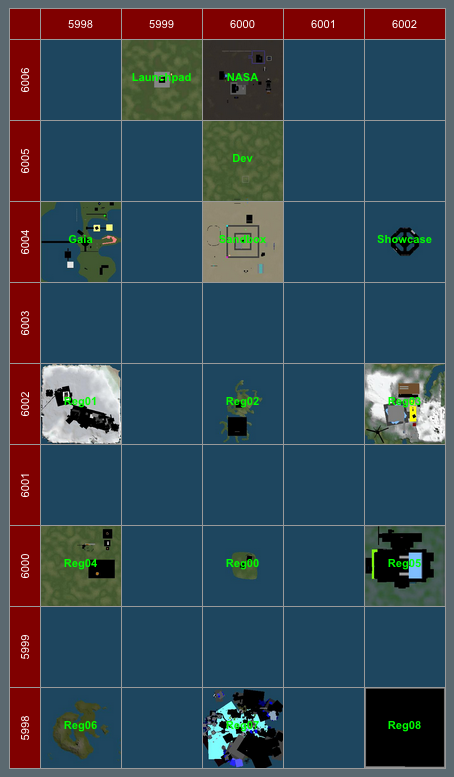
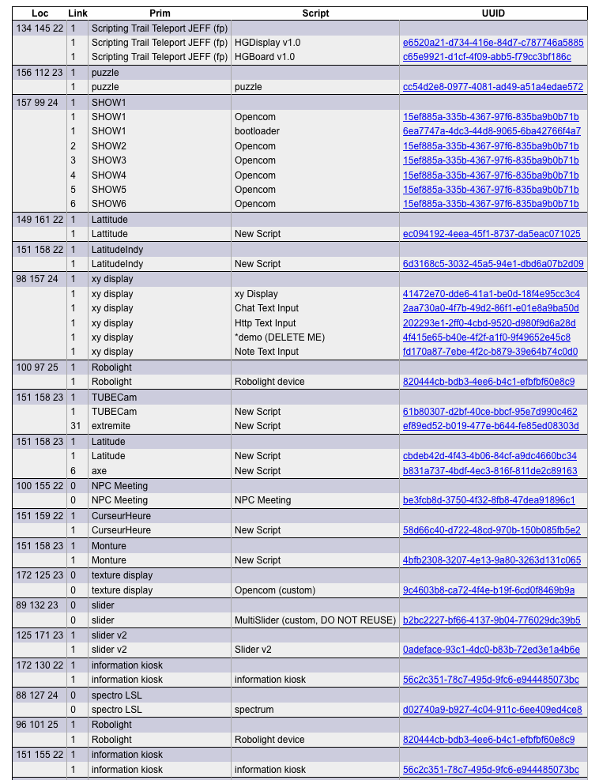
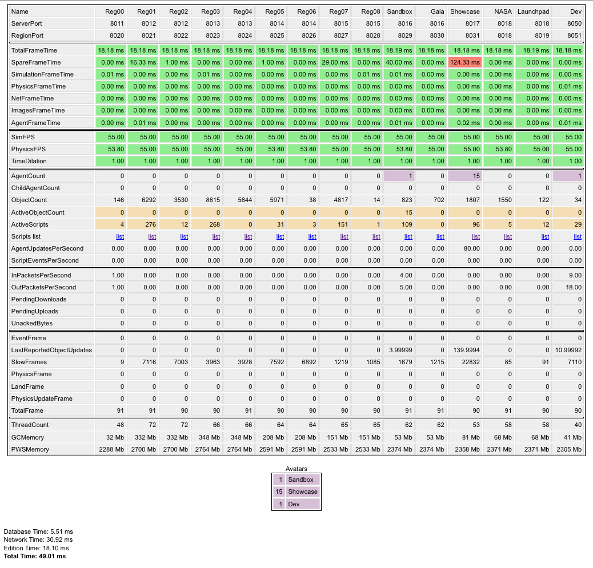

### Sparse collection of utilities for opensimulator.

##### gridmap.php : Show a map of your grid.

This script queries ROBUST or the database to obtain the list of regions and their parameters. It then computes grid bounds and prints a HTML table with images pointing to ROBUST's maptiles.
 
[full size image](doc/gridmap.png)

##### gridstat.php : Show all statistics for your grid. 

This script queries ROBUST or the database to obtain the list of regions and their parameters. It then queries all simulators' monitoring module (/monitorstats/<region-uuid>) and prints a HTML table with statistics.

Links to scripts.php.

[full size image](doc/gridstats.png)

#### scripts.php : List region scripts.

This script queries the database for a list of all scripts contained in a region. It generates a table with script name, link name, root name and position.

Links to getasset.php.

[full size image](doc/scripts.png)

#### getasset.php : Dump a raw asset. 

Queries tha database for a given UUID and returns content. Used to retrieve scripts. Do not use for binary assets.

#### db_access.php : MySQL credentials.

Common to all scripts.

All together, these scripts allow you to dive into each and every script source code in your grid. Access should be granted to grid managers only (use .htaccess).